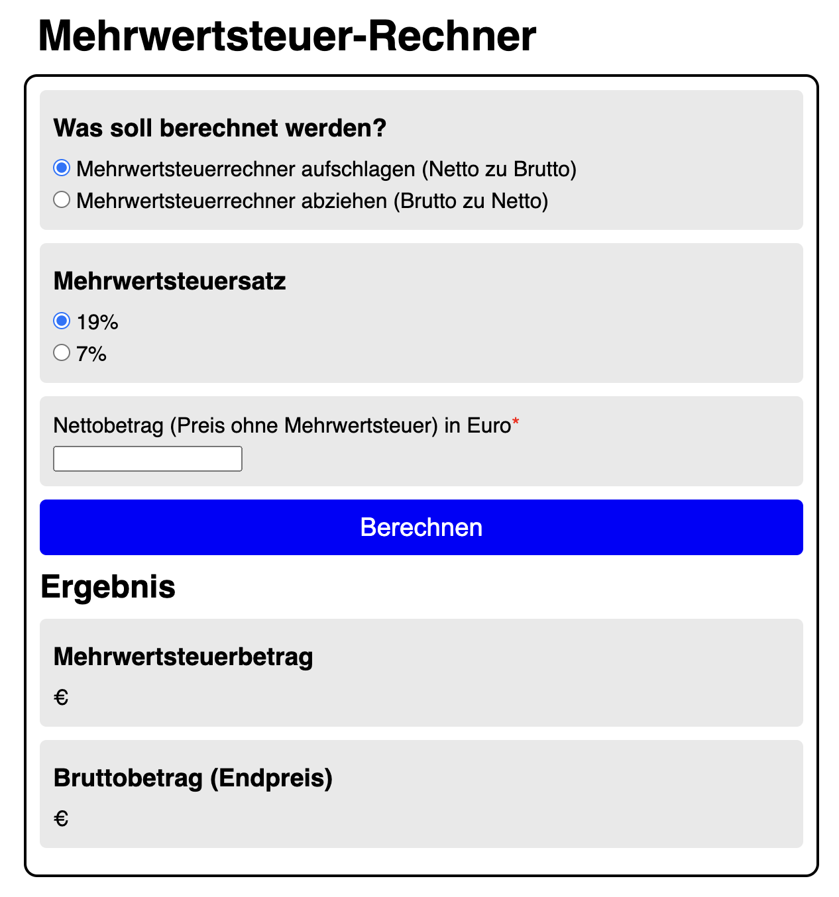

# Mehrwertsteuer-Rechner 🧮💶

💻 https://moniqueheusinger.github.io/Mehrwertsteuerrechner/

Online-Tool zur Berechnung von Brutto- oder Netto-Preisen bei einer Mehrwertsteuer von 19% oder 7%

## Screenshots 📸

## Tech Stack 🛠️

HTML5, CSS3, Java Script

## Features ⭐️

- Rechnet einen Nettobetrag in einen Bruttobetrag um (in Euro)
- Rechnet einen Bruttobetrag in einen Nettobetrag um (in Euro)
- Auswahl zwischen 2 Mehrwertsteuersätzen (19%, 7%)
- Gibt den Betrag der Mehrwertsteuer in Euro separat aus

## Author 👩‍💻

[@MoniqueHeusinger](https://github.com/MoniqueHeusinger)

## Lessons Learned 💡

**Vertiefung meines Java Script-Wissens, u.a.:**

- Verwendung von event listeners in Java Script, um eine arrow function auszuführen
- Aufbau einer arrow function in Verbindung mit if-/else if-statements
- Umwandlung von User-Eingabewerten in auf 2 Dezimalstellen abgerundete Werte
